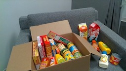
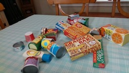
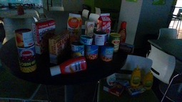
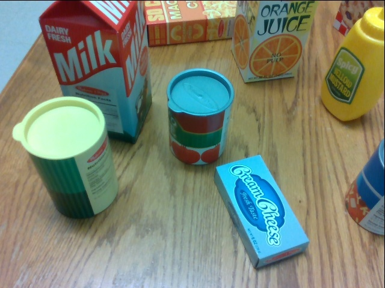
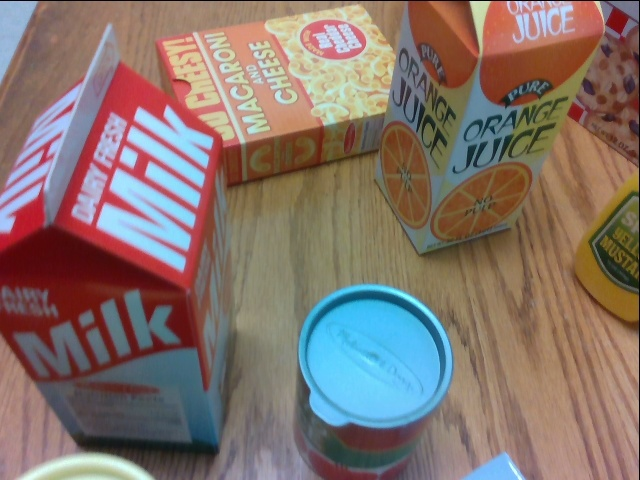
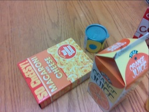
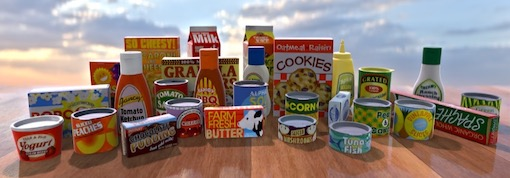

# Household Objects for Pose Estimation (HOPE)

  

The NVIDIA HOPE datasets consist of RGBD images and video sequences with labeled 6-DoF poses for 28 toy grocery objects. The toy grocery objects are readily [available for purchase](#objects) and have ideal size and weight for robotic manipulation. Further, we provide 3D textured meshes for generating synthetic training data.

The HOPE-Image dataset shows the objects in 50 scenes from 10 household/office environments. Up to 5 lighting variations are captured for each scene, including backlighting and angled direct lighting with cast shadows. Scenes are cluttered with varying levels of occlusion.

The HOPE-Video dataset consists of ten sequences captured by a camera mounted to a robotic arm. The camera is moved to survey a set of objects placed in the robot's workspace. Accompanying each video sequence is a point cloud scene reconstruction computed by [CascadeStereo](https://github.com/alibaba/cascade-stereo).

## Download

To download the dataset, install the Python package `gdown` via `pip install gdown`, then run `python setup.py` to download the dataset from [Google Drive](https://drive.google.com/drive/folders/1Hj5K9RIdcNxBFiU8qG0-oL3Ryd9f2gOY?usp=sharing) and unpack the zip archives.

By default, this tool will download the HOPE-Image validation and test sets (`hope_image/valid`, 50MB; `hope_image/test`; 179MB), the HOPE-Video set (`hope_video/`, 2.9GB), and low-resolution (`meshes/eval/`, 33MB) and high-resolution (`meshes/full/`, 98MB) meshes. Use the command line options to download specific subsets.

## HOPE-Image

The HOPE-Image dataset contains 188 test images taken in 8 environments, with a total of 40 scenes (unique camera and object poses). An additional 50 validation images are included from 2 environments in 10 scene arrangements.

Within each scene, up to 5 lighting variations are captured with the same camera and object poses. For example, the captures in `valid/scene_0000/*.json` all depict the same camera pose and arrangement of objects, but each individual capture (`0000.json`, `0001.json`, ...) has a different lighting condition. For this reason, each image should be treated independently for purposes of pose prediction. The most favorable lighting condition for each scene is found in image `0000.json`.

  

Images were captured using a RealSense D415 RGBD camera. We observed systematic errors in the depth values relative to the estimated distance of a calibration grid. To correct for this, we scaled depth frames by a factor of `0.98042517` before registering to RGB. Annotations were made manually using these corrected RGBD frames.

**NOTE: Only validation set annotations are included in this current release. Test annotations will be made available at a later time.**

## HOPE-Video

The HOPE-Video dataset contains 10 video sequences (2038 frames) with 5-20 objects on a tabletop scene captured by a robot arm-mounted RealSense D415 RGBD camera. In each sequence, the camera is moved to capture multiple views of a set of objects in the robotic workspace. We first applied [COLMAP](https://colmap.github.io/) to refine the camera poses (keyframes at 6~fps) provided by forward kinematics and RGB calibration from RealSense to Baxter's wrist camera. 3D dense point cloud was then generated via [CascadeStereo](https://github.com/alibaba/cascade-stereo) (included for each sequence in `scene.ply`). Ground truth poses for the HOPE objects models in the world coordinate system were annotated manually using the CascadeStereo point clouds. The following are provided for each frame:

- Camera intrinsics/extrinsics
- RGB images of 640x480
- Depth images of 640x480
- 3D scene reconstruction from [CascadeStereo](https://github.com/alibaba/cascade-stereo)
- Object pose annotation in the camera frame

  

## Objects



Objects consist of a set of 28 toy grocery items selected for compatibility with robot manipulation and widespread availability. Textured models were generated by an EinScan-SE 3D Scanner, units were converted to centimeters, and the centers/rotations of the meshes were aligned to a canonical pose.

Full size textured models may be downloaded [here]( https://drive.google.com/drive/folders/1jiJS9KgcYAkfb8KJPp5MRlB0P11BStft).

As of late 2020, all objects could be obtained from online retailers for about 50 USD:
* [Melissa & Doug "Grocery Boxes"](https://www.amazon.com/gp/product/B071ZMT9S2) ("Crispy Crisps", "Pancake Mix", and "Crackers" were omitted from our dataset because their larger size made scanning difficult)
* [Melissa & Doug "Let's Play House Grocery Cans"](https://www.amazon.com/gp/product/B007EA6PKS)
* [Melissa & Doug "Fridge Groceries"](https://www.amazon.com/gp/product/B00H4SKSPS) ("Deli Cheese Slices" and "Deli Meat Slices" were omitted from our dataset because their thin shape made scanning difficult)
* [Melissa & Doug "Favorite Condiments"](https://www.amazon.com/gp/product/B072M2PGX9)

## Preview tool

Use the included visualization tool `preview.py` to view annotated images in the validation set. The tool requires the following Python packages: numpy, open3d, trimesh, networkx, pyglet, and PIL. The packages can be installed with the following command: `pip install numpy open3d trimesh networkx pyglet Pillow`. **There is a [known issue](https://github.com/intel-isl/Open3D/issues/1898) with recent versions of Open3D and Ubuntu 16.04. If you run into this problem, you may need to use Python 3.7 or earlier and revert to an older version of Open3d: `pip install open3d==0.9.0`.**

```
Usage: `preview.py [-h] [--showrgb] [--rgbpath PATH] [--depthpath PATH] [--pcpath PATH] [--meshdir PATH] PATH`

Display a scene from the HOPE-Image or HOPE-Video datasets. By default, object
annotations are overlaid on either the reconstructed scene point cloud or RGBD.
An overlay on the RGB image can be shown with `--showrgb`. File paths are
automatically attempted relative to the annotation file path. Press O to toggle
objects, D to toggle RGBD (if present), P to toggle scene point cloud (if
present), and Q to quit.

positional arguments:
  PATH              Path to scene annotation file

optional arguments:
  -h, --help        show this help message and exit
  --showrgb         Show RGB image instead of RGBD and/or point cloud
                     
  --rgbpath PATH    Path to RGB image
                    (optional, default: annotspath.replace(".json","_rgb.jpg"))
  --depthpath PATH  Path to depth image
                    (optional, default: annotspath.replace(".json","_depth.png"))
  --pcpath PATH     Path to scene point cloud
                    (optional, default: dirname(annotspath)+"/scene.ply"))
  --meshdir PATH    Path to object meshes
                    (optional, default: meshes/eval/)
```

## License

Copyright (C) 2021 NVIDIA Corporation. All rights reserved. Licensed under the [CC BY-NC-SA 4.0 license](https://creativecommons.org/licenses/by-nc-sa/4.0/legalcode).
